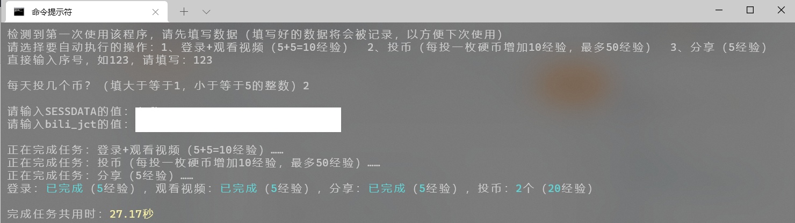

# 哔哩哔哩自动完成任务（Python版）

#### 介绍
这里是哔哩哔哩自动完成任务使用的一些文件~

#### 使用说明
1. **对于Linux操作系统用户**：请在使用本程序前修改本程序的源代码的第20行代码为以下代码，否则会导致报错。
```Python
appdata = "~" # “~”为您想保存配置文件的路径
```
2. 本程序仅供内部测试，请勿告诉B站；
3. 由于B站有智能拦截机器，所以部分任务可能会失败；
4. 建议大家自己完成任务，不要使用一些非法手段来骗B站！

#### 参与贡献
本程序由“[wuziqian211](http://gitee.com/wuziqian211)”协助完成，感谢用户“[wuziqian211](http://gitee.com/wuziqian211)”的大力支持！